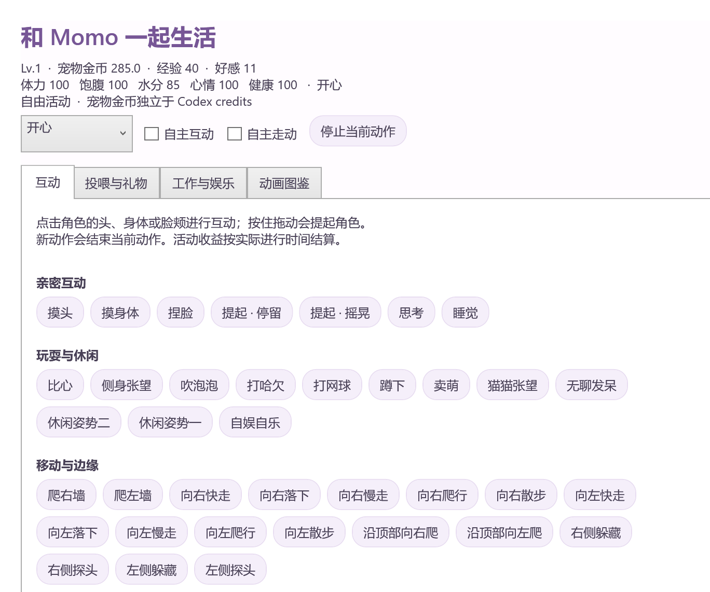

# Momo · Codex 桌宠

日系萌系 Windows 桌宠，使用 VPet 原版透明 PNG 序列动画。**160 × 124 的头顶小气泡**默认显示 Codex 本周剩余 / 已用、credits 余额、同步状态与重置时间，可在角色右键菜单或托盘关闭和重新开启。

An anime-style Windows desktop companion with a compact speech bubble showing Codex weekly quota and credit balance. Built with .NET 8 / WPF; reuses the local Codex App Server sign-in. This is an independent community project.


上图使用合成演示数据，不含真实账号信息。默认界面没有名称栏或底部按钮，主文字 10–13 px，辅助文字 9 px。额度气泡默认在头顶，右键或托盘可关闭，重启记住选择。普通模式角色画布为 256 × 256，小巧模式为 192 × 192，额度卡片保持 160 × 124。爬右墙或右侧躲藏时气泡移到左侧，左墙移到右侧，顶部动作移到下方；靠近屏幕顶部时也会自动放到下方。气泡换向或开关保持角色位置，墙边动作以角色不透明图像边界贴边。

## 启动

1. 从 [GitHub Releases](https://github.com/KyonXXXX/momo-codex-pet/releases/latest) 下载 Windows ZIP 并完整解压。
2. 确保 Windows 10/11 已安装 **.NET 8 Windows Desktop Runtime（x64）**，并在 Codex 桌面版中登录 ChatGPT 账号。
3. 双击 **Momo.exe**。请将整个解压目录保留在固定位置。

从源码构建时可用 `tools/build.ps1 -DesktopShortcut` 创建 **Momo Codex 桌宠** 桌面快捷方式。

本机已安装的 .NET 8 Windows Desktop 运行时即可运行此版本。Codex 桌面版需要已登录 ChatGPT 账号。桌宠会自动找到 Codex 可执行文件，每 60 秒通过其官方 App Server 的 `account/rateLimits/read` 读取额度。也可以点击卡片上的 ↻ 立即刷新。

主面板永远显示 Codex 主额度桶；一周根据 `windowDurationMins = 10080` 识别，可以在 primary 或 secondary 中。其他额度桶（如 Spark）的信息可从「查看所有额度与同步详情」查看。

余额单位为 **credits**，不是货币；卡片保留两位小数，悬停在数字上可看精确余额。周窗口和重置时间以服务实际返回值为准，不假定每周一重置。时间采用电脑本地时区。

## 今日剩余可用额度

绿色进度条显示「今日剩余可用」，100% 表示周总额度的 1/7（约 14.29%）。只使用账号当前周剩余额度和周重置时间，其他电脑的使用会在下一次同步时反映，无需本机历史记录。

按周重置周期划分 7 个 24 小时额度日，剩余天数向上取整并包含今天，与电脑时区和本地午夜无关。设周剩余为 R、剩余天数为 D、一天基础额度 B = 100 / 7：当 R ≥ D × B 时，今天可用量为 R / D；否则为 max(0, R − (D − 1) × B)。展示百分比为今天可用量 / B × 100。

透支优先抵扣今天，不足则继续抵扣后续天；结余按剩余天数均分。例如还剩 3 天，周剩 30% 时显示 10%，周剩 60% 时显示 140%。超过 100% 表示有结余，数字保留真实比例，进度条最多满格；0% 表示今天的参考额度已耗尽。该值是根据当前余额推算的分配参考，不是官方日限额，也不重建历史日用量。

每 60 秒同步一次，也可手动刷新。首次启动即可计算，不再读取或写入旧 daily-usage.json；宠物存档与设置保持兼容。离线同一额度日保留上次结果并标注离线，跨额度日或周重置后显示 —，等待新同步。

当 R < (D − 1) × B 时，切换为红色「今日已超额」，超额百分比 = ((D − 1) × B − R) / B × 100。例如剩余 3 天、周剩 25%，显示「今日已超额 25%」。这是截至今天相对分配进度的累计透支，包含前几天结转的超额，不是仅今天的真实消耗。恰好用完时仍显示剩余 0%；超额超过 100% 时数字保留实际比例，红色进度条最多满格。额度恢复、跨日抵扣完透支或周重置后自动恢复剩余显示。

## 使用

### 跟随 Codex Desktop 启动

默认开启，可在桌宠右键菜单切换「跟随 Codex Desktop 启动」。开启后，后台监听器随当前用户登录 Windows 启动，每 2 秒检查一次 Codex Desktop；检测到桌面版启动且桌宠尚未运行时启动桌宠。它按已安装的 OpenAI.Codex Windows 应用包路径识别桌面进程，忽略命令行、额度读取子进程及 Electron 子进程重启，并兼容应用包版本变化。

手动退出桌宠后，同一次 Codex 会话中不会反复拉起；下一次重新启动 Codex 时才再次跟随。关闭 Codex 不会自动退出桌宠。关闭该开关会移除监听器的当前用户登录启动项，后台监听器约 2 秒内结束。原有「开机启动」独立控制桌宠是否登录后立即显示。

监听注册项为 HKCU\\Software\\Microsoft\\Windows\\CurrentVersion\\Run\\MomoCodexDesktopFollower，运行 Momo.exe --watch-codex；监听器没有窗口或托盘图标，也不创建 Codex 任务或模型请求。移动程序目录后重新打开 Momo 会修复监听启动路径。更新已安装程序前可运行 Momo.exe --stop-codex-watcher 结束监听器，再关闭桌宠并替换程序。

### 自动购买补充

默认开启，可在「互动与动画图鉴」顶部关闭「自动购买补充（<60）」，重启记住选择。体力、饱腹、水分、心情或健康低于 60 时，使用宠物金币自动购买并立即补充，每 30 秒最多购买一件。

优先补最低且有可购买道具的指标；优先选择能补到 60 的最便宜道具，无法一次补到 60 时选择恢复量／金币更划算的道具。只使用买得起且不降低其他指标的商店物品；金币不足时等待，不借贷或购买金币。工作、专注和休息继续进行，手动投喂期间暂停自动购买。恢复到 60 及以上后停止针对该指标购买；好感和经验不触发自动购买。

自动补充直接扣款并生效，不播放投喂动画；气泡会提示购买，互动面板显示本次启动的最近购买记录。手动投喂仍在动画结束后扣款，中途取消不扣费。宠物金币独立于 Codex credits。

**2.0 完整互动版：**右键桌宠或系统托盘 → **互动与动画图鉴**。默认角色的 **67 类动作、609 组动画、6,181 帧**全部接入，并提供四种状态和各动画变体的搜索播放入口。详见 [完整覆盖清单](docs/vpet-coverage.md)。

- 互动：摸头、摸身体、捏脸、提起／摇晃、待机、卖萌、蹲下、打哈欠、吹泡泡、网球、思考、说话、生日与升级庆祝。
- 移动：散步、快走、慢走、爬行、左右爬墙、沿顶部移动、落下和侧边躲藏／探头。自主互动默认开启，自主走动可在面板开启。
- 投喂：123 种食物、饮料、药品和礼物，使用 12 套原始分层动画；完成后扣除宠物金币并改变数值，取消不扣费。另提供免费清水与基础餐。
- 活动：13 项工作、学习和娱乐，有原始时长或 1 分钟体验；工作赚宠物金币、学习获得经验、娱乐改善心情，停止时按实际时长结算。低体力／健康会暂停。
- 生活：体力、饱腹、水分、心情、健康、好感、经验和宠物金币随存档保留；离线不惩罚。表情可自动跟随数值，也可手动选择开心／平常／低落／生病。
- 音乐：选择本地音乐后播放并配合音乐动画；停止动作会停止播放。启动与退出播放迎接／告别动画，领养纪念日自动庆祝。

**宠物金币与 Codex credits 完全独立。**游戏中的「清屏」「删错误」「修屏幕」是虚拟活动，不会操作或删除电脑文件。此版本覆盖官方核心默认角色的动画互动；不包含 Steam 创意工坊、第三方模组、云存档或上游插件平台。



| 操作 | 功能 |
| --- | --- |
| 单击头部 / 身体 / 脸颊 | 摸头、摸身体或捏脸 |
| 拖动角色 | 按原版衣角锚点提起，鼠标移动时摇晃，放下后记住位置 |
| 拖动卡片空白处 | 平移整个桌宠 |
| 右键 → 互动与动画图鉴 | 完整互动、投喂、工作娱乐与全部动画 |
| 右键 → 停止当前动作 | 停止播放或移动，结算活动并恢复待机 |
| 右键 → 专注 25 分钟 / 结束专注 | 开始或结束专注计时，角色陪读 |
| 右键角色 / 托盘 → 显示额度气泡 | 关闭或重新开启头顶气泡，记住选择 |
| 右键角色 / 卡片或点 ··· | 查看额度详情、置顶、大小、小巧模式、开机启动、素材说明 |
| Ctrl+Alt+M | 显示 / 隐藏桌宠（快捷键注册成功时可用） |
| 双击系统托盘图标 | 找回桌宠 |
| 托盘 → 回到屏幕右下角 | 位置恢复 |
| 菜单 / 托盘 → 退出桌宠 | 彻底退出 |

默认置顶，默认不开机启动。开机启动可在菜单中自行开关，只修改当前用户的 `HKCU\Software\Microsoft\Windows\CurrentVersion\Run\MomoCodexPet`。隐藏到托盘是用户主动关闭常驻显示，恢复后继续显示额度。

每周剩余不超过 15% 时，默认每个重置窗口提醒一次（每次启动重新计数），可在菜单关闭提醒。25 分钟结束会弹出系统通知；计时以实际结束时间计算，电脑休眠后也不会停在旧时间。未完成的专注不跨程序重启恢复。

## 数据与连接

- 使用本机 Codex 管理的登录状态；不读取、复制、保存登录 token，也不需要 API key。
- 只启动自己的临时 `codex app-server --stdio` 子进程，并调用 initialize、initialized、account/rateLimits/read。不会创建任务或发起模型请求。
- 每次读完结束自己的子进程，不停止用户的 Codex，不触碰其运行中的任务。
- 断网 / 读取失败保留内存中的上次数据并标记「离线」；悬停同步状态可看最近成功同步时间，详情窗口也会注明旧数据。超过两分钟的数据同样标记离线。启动时不会拿旧缓存假装新数据。
- 服务未返回的数字显示「— / 未提供」，不会伪装成余额为零。应用不会自动购买额度或兑换重置次数。
- 配置保存到 `%LOCALAPPDATA%\MomoCodexPet\settings.json`，包括位置、大小、气泡显示开关、提醒开关和完成专注次数。账号余额不写进配置。
- 若未自动发现 Codex，可设置用户环境变量 `MOMO_CODEX_PATH` 为真实的 `codex.exe` 绝对路径。也会尊重 Codex 自身使用的 `CODEX_HOME`。
- 如果读取失败，请先在 Codex 中确认 ChatGPT 账号已登录，随后点击 ↻；纯 API key 登录通常无法读取订阅周额度。

## 素材与授权

应用源代码按 [MIT License](LICENSE) 提供。**MIT 不覆盖角色素材**。

角色动画来自 [LorisYounger/VPet](https://github.com/LorisYounger/VPet)，版权所有：**虚拟主播模拟器制作组**。本应用保留原始透明 PNG 帧与原始帧时长，完整包含固定版本的 609 组、6,181 帧；按文件哈希去重，动画和物品图像约 503 MB。完整包随附素材，首次运行无需联网下载图片。旧版 111 帧兼容序列仍保留。

完整动画授权见 [licenses/VPet-Animation-License.zh-CN.md](licenses/VPet-Animation-License.zh-CN.md)，程序右键菜单也提供来源与授权页。全部源路径、固定上游 commit 与逐文件 Git blob 校验值保存在 `assets/vpet-catalog.json`。上游配置转换与 Apache-2.0 许可说明见 [VPet-NOTICE](licenses/VPet-NOTICE.md)。

素材在非商用场景下按上游的署名及链接条件使用；如改作商用或重新分发，请遵循随附原文的相应条件。动画素材不得收费出售。

接口参考：[OpenAI Codex App Server](https://learn.chatgpt.com/docs/app-server)。

## 开发与验证

使用 .NET 8 SDK，不依赖额外 NuGet UI 库：

```powershell
node tools/sync-vpet.mjs
node tools/verify-vpet.mjs
dotnet build -c Release
dotnet publish -c Release -o dist/Momo
.\bin\Release\net8.0-windows\Momo.exe --self-test --live
.\bin\Release\net8.0-windows\Momo.exe --capture artifacts/preview.png
.\bin\Release\net8.0-windows\Momo.exe --capture artifacts/preview.png --verify-auto-refresh
.\bin\Release\net8.0-windows\Momo.exe --capture artifacts/demo.png --demo
.\bin\Release\net8.0-windows\Momo.exe --capture artifacts/full.png --demo --full-test
```

自测覆盖：primary / secondary 周窗口、主桶选择、缺失数据、精确余额、零值、异常时间与动画帧加载；`--live` 额外测试真实 Codex 额度。报告生成于 `artifacts/test-results.txt`。`--capture` 测试真实按钮路由、计时完成、显示 / 隐藏、越界位置、过期状态和缺失数据，然后使用实际 WPF 渲染及实际账号数据导出四种状态，随后退出，不保存设置。附加 `--verify-auto-refresh` 会等候真实的 60 秒刷新周期，验证程序独立更新数据。

也可运行 `tools/build.ps1 -DesktopShortcut` 完成构建、自测、发布及创建桌面快捷方式。

`--demo` 只能与 `--capture` 合用，使用固定合成数据且不读取账号，适合生成公开截图。`--capture` 和 `--live` 产生的真实数据报告仅应留在本地；`artifacts/`、用户配置、凭据文件、构建输出和本机快捷方式均排除在 Git 之外。

## 相似项目

GitHub 上已有 Codex 宠物额度显示工具，包括 Windows 的 Quota Buddy / Codex Pet Dock，以及 macOS 的额度圆环和独立额度桌宠。平台、显示方式及信息差异见 [相似项目检索](docs/similar-projects.md)。

## 素材维护

源码仓库保留完整目录和下载工具，大体积图片不进入 Git 历史。安装 Node.js 22+ 后运行 `node tools/sync-vpet.mjs`，会从固定上游版本下载缺失图片并验证 Git blob SHA-1；可中断后续传。`node tools/verify-vpet.mjs` 可离线验证完整性。`tools/build.ps1` 在缺图时自动同步。

完整验证 `--full-test` 会解码所有 609 组动画、核对四状态匹配，并测试分层投喂、取消／结算、实际窗口移动、触摸区域与界面。`--interaction-smoke` 与 `--full-test` 合用可在素材已经完整验证后仅回归互动路径。公开截图统一使用合成数据。

发布文件：`dist/Momo/Momo.exe`；分发时请保留同目录的全部运行文件、`assets` 和 `licenses`。
